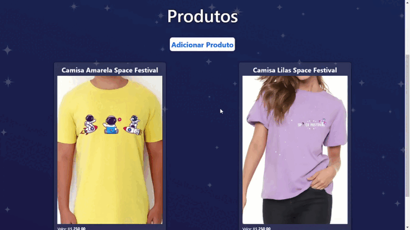

<h1 align="center">Space Festival</h1>

Projeto final do curso da Resilia em parceria com o Senac.  
Este projeto tem como tema um festival de música com temática espacial.

  <a href="#-tecnologias">Tecnologias</a>&nbsp;&nbsp;&nbsp;|&nbsp;&nbsp;&nbsp;
  <a href="#-projeto">Projeto</a>&nbsp;&nbsp;&nbsp;|&nbsp;&nbsp;&nbsp;
  <a href="#-layout">Layout</a>&nbsp;&nbsp;&nbsp;|&nbsp;&nbsp;&nbsp;

 

<h2>Home</h2>

  

<h2>Aplicação</h2>

  

## 🚀 Tecnologias

Esse projeto foi desenvolvido com as seguintes tecnologias:

- HTML e CSS
- JavaScript
- React.js
- Node.js
- MySQL
- Bootstrap

## 💻 Projeto

Nossa função era construir um app simples
(front e back-end) que vai implementar as funcionalidades básicas do CRUD e após isso desenvolvermos o site que apresenta o app.

O back-end foi feito utilizando Node, Express e SQLite.
O front-end foi feito utilizando React e Bootstrap.
